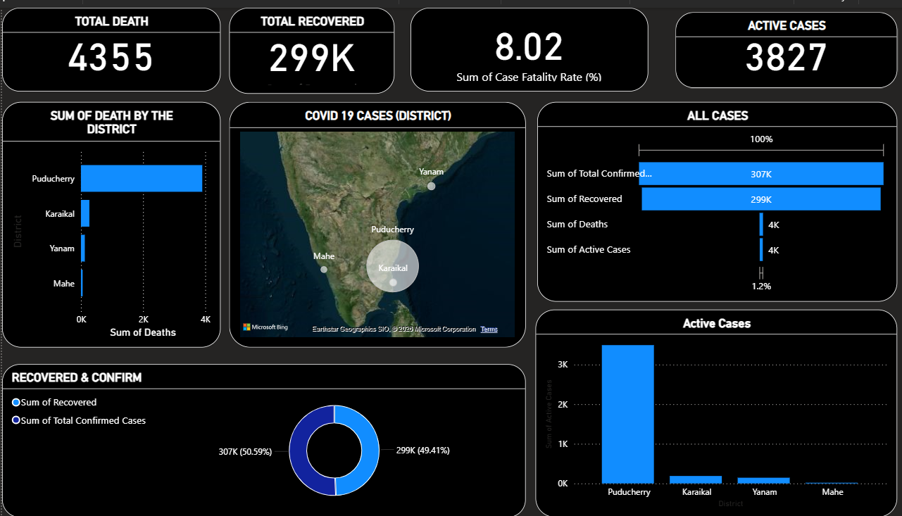

<!-- Animated Typing Header -->
<h1 align="center">
  
</h1>

  
  
  
  

  

---

## Executive Overview

This project presents an advanced Power BI dashboard analyzing COVID-19 district-level data.  

The dashboard provides a comprehensive view of confirmed cases, recoveries, fatalities, active cases, and case fatality rate across districts.

The objective is to demonstrate real-world public health data analysis using business intelligence tools.

---

## Key Performance Indicators

- Total Confirmed Cases  
- Total Recovered  
- Total Deaths  
- Active Cases  
- Case Fatality Rate (%)  

---

## Dashboard Capabilities

- District-wise death comparison  
- Geospatial case distribution (Map visualization)  
- Recovery vs Confirmed case analysis  
- Active case trend visualization  
- KPI-based summary metrics  
- Interactive filtering and drill-down  

---

## Analytical Insights

- High recovery ratio compared to fatality rate  
- Majority of deaths concentrated in specific districts  
- Active cases significantly lower than total recovered  
- Case fatality rate maintained under controlled range  

---

## Technical Stack

Power BI  
DAX  
Data Cleaning & Transformation  
Geospatial Visualization  
KPI Modeling  

---

## Data Flow Architecture

Raw Dataset → Data Cleaning → Data Modeling → DAX Measures → KPI Calculation → Dashboard Visualization → Insight Generation  

---

## Skills Demonstrated

Public Health Data Analysis  
Advanced DAX  
Time-Series Analysis  
Geospatial Reporting  
Interactive Dashboard Design  
Data Storytelling  

---

## Dashboard Preview

---

## Author

Gokul Raj  
Data Analyst | Power BI | SQL | Python | Excel
